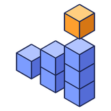

<p align="center">
  
</p>

<h1 align="center">Resource Tracker</h1>

<p align="center">
  The materials a build needs as the items you'd gather in survival, in stacks and shulker boxes,<br>
  what you have gathered so far and what is left, saved for each project.
</p>

<p align="center">
  <a href="https://github.com/doolecg/BlockDesigner-ResourceTracker/releases/latest"></a>
  <a href="https://github.com/doolecg/BlockDesigner-ResourceTracker/releases"></a>
  <a href="LICENSE"></a>
  
  <a href="https://github.com/doolecg/BlockDesigner"></a>
</p>

---

Resource Tracker is a plugin for [BlockDesigner](https://github.com/doolecg/BlockDesigner), the Windows editor for Minecraft builds. It is released
on its own, separately from the app. It needs **BlockDesigner 0.4.24 or later** (plugin API 6).

**Contents:** [Download](#download-and-install) · [Features](#features) · [Building from source](#building-from-source) · [Project layout](#project-layout)

## Download and install

Get the latest version from the [releases page](https://github.com/doolecg/BlockDesigner-ResourceTracker/releases/latest):

1. Download `resource-tracker-<version>.jar`.
2. In BlockDesigner open **Plugins (puzzle icon) › Manage plugins… › Install…** and pick the jar.

It is on straight away, with its own tab on the right. You can switch it off, reload or uninstall it in the same window, and it
updates itself (Plugins › Manage plugins… › Update plugins automatically). Plugins run with the same access as BlockDesigner itself, so only install
ones you trust.

## Features

The plugin has one tab on the right with two pages, picked by the bar at its top: **Materials** (the list) and
**BlockCompanion** (the link to the game). The page you used last comes back next time, and so do where you count, the
sort, Hide done and the game link's settings. Its one setting, **Count mobs as their spawn eggs**, is on its page in
BlockDesigner's **Settings** window (the gear on the tab opens it).

### Materials page

From top to bottom:

- **Count:** where to count (all visible layers, the selected layers, the active layer, or the current selection), and
  the refresh button to count again (it also looks at the game's progress and chests again). It recounts by itself as
  you build.
- **Items:** every item the build needs, most first, with its icon and how many **stacks and shulker boxes** that is
  ("2 shulkers + 3 stacks + 12"). **Filter**, **Hide done** and sort by most left, most needed or name.
- **At the bottom:** a bar over the whole build ("1,234 of 5,000 items placed or gathered (24%) · 3 of 20 kinds done"),
  and, when the project is linked to a build in the game, how far it is there ("In game: 35% built · 9,313 blocks
  left") with a link to the BlockCompanion page. Then **Copy list**, **Save CSV…** and **Reset…** (it asks first).

The page's button shows how many kinds are left to gather.

### Gathering

- **Gathered:** type how many you have in each row: a number, stacks (`10s`), shulker boxes (`2sh`) or a sum (`1sh + 3s + 12`). The tick marks an item
  as all gathered and the undo arrow takes that back. Each row shows what's left with a bar that fills red to green.
- **Saved per project:** what you've gathered is kept for each project file, and comes back when you open it again.

### Copy and export

- **Copy list** puts what's left on the clipboard as text ("Oak Planks: 640 (10 stacks)"); **Save CSV…** writes needed, gathered and left for every
  item as a spreadsheet. When the project is linked to the game, both include how many are placed. **Plugins › Copy materials list** copies it
  without opening the page; it and **Send project to the game** can be given keys in Settings › Keybinds.

### Entities

- **Mobs** (optional, in Settings): count mobs as their spawn eggs. Paintings, item frames (and what they hold), armor stands, boats, minecarts and end crystals
  always count as their items.

### BlockCompanion page

Everything to do with the [BlockCompanion](https://github.com/doolecg/BlockCompanion) mod (0.1.0 or later), from top to bottom:

- **Games:** every BlockCompanion game and server on this computer: **active** (green) while it runs, **disconnected** (grey)
  for a day or two after it closes, with its version, loader, what it shows and whether it is connected. Resource Tracker
  connects to active ones by itself. Tick the games your project goes to. The refresh button looks for games again,
  re-reads what they report and counts again; **Use its textures** shows blocks with the resource packs of the game selected in the list, and its server's pack
  (needs BlockDesigner 0.4.24 or later).
- **Send project:** **Send to game** sends the project to the ticked games. It appears in front of you in the game; a server
  adds it to its shared schematics. Also in **Plugins › Send project to the game**. With **Live** on, every change you make
  here reaches the ticked games a moment later, so the ghosts follow your edits.
- **Game progress:** the build in the game whose placed blocks count on the Materials page, how far it is, and how many
  linked chests count as gathered (below).
- **BlockCompanion mod:** **Install mod…** (below).
- **At the bottom, the status:** **Connected to 2 games**, **Connecting…**, **Waiting for a game** (or **No game found**),
  with how many are active and disconnected, and what the last install did. A dot in the same colour is on the page's
  button, even before you open the page.

Live and the ticks are saved. **Grab from the game:** BlockCompanion's **Grab from BD** button asks for the open project;
Resource Tracker answers even while the panel is closed.

#### Game progress

BlockCompanion writes how far a build is in the game to `<your user folder>\.blockcompanion\progress` while you build.

- **Linked automatically:** the **Game progress** picker links the project to the build in the game whose project name is the
  project's name (or whose schematic file name is the project file's name), ignoring case. If there are several (the project
  loaded more than once), the most recently updated wins. Pick another build or **Not linked** instead; the choice is saved
  for each project.
- **Placed counts as done:** each row on the Materials page shows how many are **placed** in the game, and an item with all
  of it placed is done by itself. What's left is `needed − placed − gathered`, so **Gathered** now means what you have in
  hand and haven't placed yet (the row's tooltip spells it out). **✓** fills in just what isn't placed. The progress bar
  counts placed and gathered.
- **Live:** it looks at the folder every 2 seconds and shows "In game: 35% built · 9,313 blocks left · updated 5 s ago", or
  "not seen for 10 min" when the game hasn't written for 5 minutes. A file caught half-written keeps the last good numbers.
- The game counts the visible layers of the project, so its numbers line up best with **Count: All visible layers**.
- Without BlockCompanion, or with **Not linked**, everything works as before.

#### Linked chests

Chests you link in the game (sneak and right-click them with the stick) count as gathered, and each row on the Materials
page says how many are in chests.

#### Install mod…

Puts the latest BlockCompanion release into a game's `mods` folder (a Paper server's `plugins`), the jar for its loader and
Minecraft version, and removes older BlockCompanion jars there. Pick a game from the list or another game folder. Restart
the game afterwards.

The games are found through small files in `<your user folder>\.blockcompanion\instances`, and the connection only
listens on this computer.

### How blocks become items

The count is in the items you'd need in survival, not in blocks:

- A **double slab** is two slabs. **Doors, beds and tall plants** are one item for both halves. **Waterlogging** costs nothing extra.
- **Candles, sea pickles, turtle eggs, snow layers, petals and leaf litter** count how many there are in the block.
- **Crops** are their seeds (wheat → wheat seeds, carrots → carrot…). **Wall torches, signs, banners, heads and coral fans** are the item you place.
  **Potted plants** are a flower pot and the plant. **Redstone wire** is redstone dust and **tripwire** is string. **Candle cakes** are a cake and a candle.
- **Water and lava sources** are a bucket each; flowing water and lava, fire, portals and piston heads cost nothing.

## Building from source

You need Windows and a JDK 26 (Temurin 26 is what BlockDesigner uses; set `org.gradle.java.home` in
`gradle.properties` to yours). Then:

```
./gradlew jar      # build/libs/resource-tracker-<version>.jar
```

The plugin compiles against the BlockDesigner plugin API jars in [`libs/`](libs) (from BlockDesigner 0.4.24). The app
provides them, Jackson and JavaFX at runtime, so they are never bundled into the plugin. To target a newer API, replace them
with the jars from a newer BlockDesigner build (`./gradlew :plugin-api:jar :core:jar` in the
[BlockDesigner repository](https://github.com/doolecg/BlockDesigner)) and update the file names in `build.gradle.kts`.

The version is set in `build.gradle.kts` and copied into the jar's `blockdesigner-plugin.json`. To release a new
version, change it there, add a section to [RELEASE_NOTES.md](RELEASE_NOTES.md), build the jar and attach it to a
GitHub release tagged with the version.

For writing plugins, see BlockDesigner's [plugin guide](https://github.com/doolecg/BlockDesigner/blob/main/PLUGINS.md) and
[API reference](https://github.com/doolecg/BlockDesigner/blob/main/docs/plugin-api-reference.md).

### Tests

```
./gradlew test
```

The tests cover the plugin's logic that runs without the app, against the API jars in `libs/`.

## Project layout

| Path | What it does |
|---|---|
| `src/main/java` | The plugin's code: `Items` (blocks and entities to items), `Tally` (counting a scope), `Gathered` (saved progress and game link), `GameProgress` and `ProgressFolder` (BlockCompanion's progress files), `GameInstance`, `GameConnection` and `GameLinks` (the live link), `ModInstaller` (installing BlockCompanion), `Prefs` (the saved page state), `TrackerSession` (what both pages share: the count, the link, the look at the games every 2 seconds, the page's status dot), `LinkStatus`, the pages (`TrackerPanel`: Materials; `GameLinkPanel` and `GameLinkPane`: BlockCompanion) |
| `src/main/resources/blockdesigner-plugin.json` | The manifest BlockDesigner reads: id, name, version, main class, API level |
| `src/test/java` | Tests |
| `libs/` | The BlockDesigner plugin API jars it compiles against |

## License

[MIT](LICENSE)
